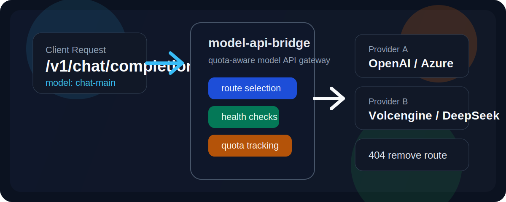
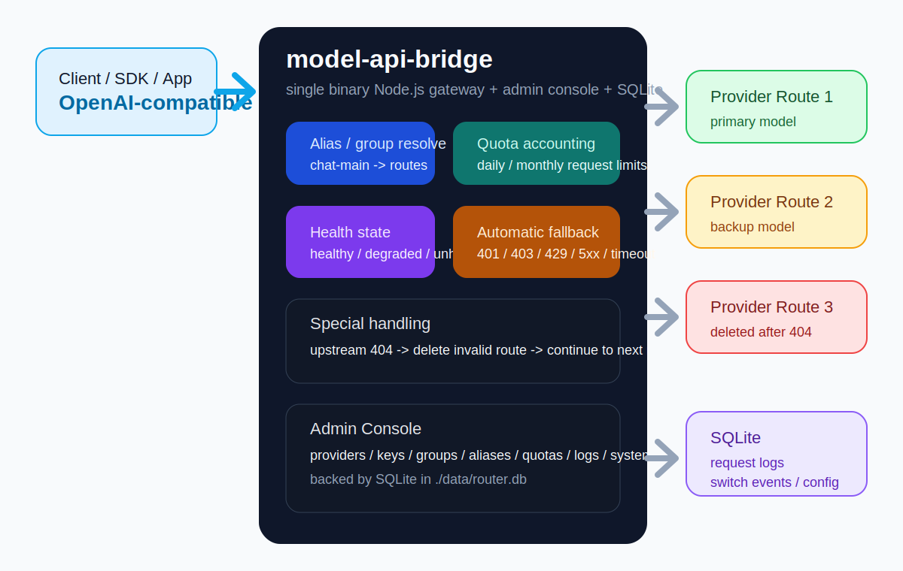

# model-api-bridge



`model-api-bridge` 是一个面向个人和小团队的自托管模型网关。它提供 OpenAI-compatible API，对接多个上游服务商，按逻辑模型名完成路由、限额控制、健康检查和自动切换，并带一个可直接操作的 Web 管理台。

## 核心能力

- OpenAI-compatible gateway：支持 `/v1/chat/completions`、`/v1/responses`、`/v1/embeddings`、`/v1/models`
- 逻辑模型桥接：把客户端请求的统一模型名映射到一个模型组中的多个真实上游模型
- 配额感知路由：按 `Provider Key + Model Route` 统计日/月请求额度
- 自动回退：遇到 `401`、`403`、`429`、`5xx`、超时、网络错误时切到下一条可用路由
- 404 自愈：上游明确返回“模型不存在 / 无权限”时，自动删除失效路由并继续尝试下一条
- 健康检查：支持被动失败累计和主动 `/v1/models` 探测
- Web 管理后台：服务商、API Key、模型组、别名、候选路由、额度、请求日志、切换日志、系统设置
- SQLite 持久化：适合单机自托管，不依赖外部数据库

## 架构图



## 适用场景

- 想把多个 LLM 提供商接成一个统一入口
- 想用统一模型名屏蔽上游模型变更
- 想把免费额度、备用 key、候选模型组织成稳定的回退链
- 想在本地或内网运行一个可视化的模型路由控制台

## 快速开始

### 环境要求

- Node.js 22+

### 安装与启动

```bash
npm install
npm start
```

也可以直接运行：

```bash
node src/server.js
```

默认地址：

- 管理后台：`http://127.0.0.1:8787/admin`
- Gateway API：`http://127.0.0.1:8787/v1`

## 首次配置

1. 打开管理后台，初始化管理员密码。
2. 可选配置 Gateway API Key，作为客户端访问网关时的统一入口密钥。
3. 添加一个或多个上游服务商。
4. 为服务商录入 API Key。
5. 创建逻辑模型组，例如 `chat-main`、`coding-main`、`embedding-main`。
6. 为模型组添加候选路由，设置上游模型名、优先顺序和额度。
7. 可选给模型组增加外部别名，让客户端始终只使用稳定模型名。

## 客户端接入

把任意 OpenAI-compatible SDK 指向本服务的 `/v1` 即可。

示例：

```text
Base URL: http://127.0.0.1:8787/v1
API Key: <你的 Gateway API Key，可选>
Model: chat-main
```

客户端不需要知道真实上游模型名，也不需要关心当前命中了哪一家 provider。

## 路由与故障处理

一个逻辑模型组下面可以配置多条候选路由。系统会按下面的顺序挑选：

1. 跳过被禁用、健康状态为 `unhealthy`、或额度已耗尽的 route
2. 优先使用没有在当天触发过 `429` 的 route
3. 再按 `route_order`、provider 优先级和 route id 排序

请求过程中的行为：

- 上游成功：记录请求日志，并将 key 状态恢复为 `healthy`
- 网络错误或超时：记录失败，必要时切下一条 route
- `401`、`403`、`429`、`5xx`：记录失败并自动回退
- `404`：认定该 route 对应的上游模型已失效，删除当前 route 后继续回退

这使得 `model-api-bridge` 更适合接不稳定、经常调整模型名、或权限变化频繁的上游平台。

## 管理台包含什么

- 服务商管理：名称、Base URL、优先级、超时
- API Key 管理：主 key、备 key、启停状态、健康状态
- 模型组管理：逻辑模型组、fallback policy、强制路由
- 别名管理：对外暴露稳定模型名
- 路由管理：上游模型名、优先顺序、额度、告警阈值
- 日志管理：请求日志、切换日志
- 系统设置：Gateway API Key、客户端接入片段

## 数据与目录

项目主要目录：

- `src/`: Node.js 后端
- `public/`: 管理后台静态资源
- `data/`: SQLite 运行数据
- `data-backups/`: 数据快照
- `assets/`: README 展示图

默认数据库文件：

- `data/router.db`

## 可配置环境变量

- `HOST`
- `PORT`
- `DATA_DIR`
- `PROVIDER_TIMEOUT_MS`
- `FAILURE_THRESHOLD`
- `HEALTHCHECK_INTERVAL_MS`

## 开发与测试

启动开发实例：

```bash
node src/server.js
```

运行测试：

```bash
npm test
```

## 设计取舍

- 使用 SQLite，换来更低部署成本和更少外部依赖
- 配额单位按“请求次数”计，而不是 token 或金额
- 当前 fallback 仍以同一模型组内切换为主，不做复杂跨等级降级
- Provider API Key 会持久化到本地数据库，适合可信自托管环境
- Gateway API Key 只存哈希值，不回显明文

## 后续适合继续扩展的方向

- 更细的 fallback 策略
- token / 金额级别额度统计
- 命中日志检索与过滤
- Webhook 或邮件告警
- Docker / systemd / compose 部署模板
